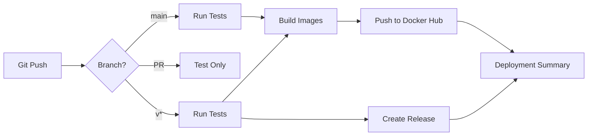

# Phase 6: CI/CD & Production Deployment

## 📋 Overview

Phase 6 completes the project with automated CI/CD pipeline, production deployment scripts, and comprehensive deployment documentation.

## 🎯 Goals

- ✅ Automated testing and deployment via GitHub Actions
- ✅ Multi-platform Docker builds (AMD64 + ARM64)
- ✅ Version management with semantic versioning
- ✅ Production-ready deployment scripts
- ✅ Comprehensive deployment documentation

## 📦 Deliverables

### 1. GitHub Actions Workflows

**`.github/workflows/ci-cd.yml`** - Main CI/CD Pipeline

**Triggers:**
- Push to `main` branch → Build and push `latest` tag
- Push version tag (e.g., `v1.0.0`) → Build and create release
- Pull requests → Run tests only

**Jobs:**
1. **backend-tests** - Run all backend tests
   - Pre-build environment checks
   - Unit tests
   - Integration tests

2. **frontend-tests** - Frontend testing and build
   - TypeScript type checking
   - ESLint code quality
   - Production build test
   - Upload build artifacts

3. **docker-build-push** - Build and deploy
   - Multi-platform builds (AMD64 + ARM64)
   - Push to Docker Hub
   - Tag with: `latest`, `<sha>`, `<version>`
   - Docker layer caching for faster builds

4. **create-release** - GitHub Release (for version tags only)
   - Generate changelog from commits
   - Create release with Docker pull commands
   - Attach deployment instructions

**`.github/workflows/pr-checks.yml`** - Pull Request Validation

**Checks:**
- ✅ PR title follows conventional commits
- ✅ No merge conflicts
- ✅ Code quality (console.log warnings)
- ✅ Security vulnerability scan
- ✅ All test suites pass
- ✅ Generate PR summary

### 2. Build Scripts

**`build-multiplatform.sh`** - Development Build Script (macOS/Linux)

```bash
#!/bin/bash
# Build AMD64 + ARM64 images using Docker Buildx
# Requires: docker buildx
# Usage: ./build-multiplatform.sh
```

Features:
- Multi-platform build support
- Loads environment from `.env.build`
- Tags with Git SHA
- Pushes to Docker Hub
- NEXT_PUBLIC_API_URL build argument

**`build-linux.sh`** - Production Build Script (Linux servers)

```bash
#!/bin/bash
# Build AMD64 images on Linux production servers
# Requires: docker build
# Usage: ./build-linux.sh
```

Features:
- AMD64 only (faster on Linux servers)
- No buildx requirement
- Tags with Git SHA
- Pushes to Docker Hub

### 3. Documentation

**`DEPLOYMENT.md`** - Comprehensive Deployment Guide

Sections:
1. **Overview** - Deployment architectures
2. **Prerequisites** - Requirements and setup
3. **CI/CD Pipeline** - Automated workflows
4. **Manual Deployment** - Build scripts and Docker commands
5. **Environment Configuration** - Production setup
6. **Monitoring & Maintenance** - Health checks, backups
7. **Troubleshooting** - Common issues and solutions
8. **Production Best Practices** - Security, performance, scaling

**`README.md` Updates:**
- Added CI/CD & Deployment section
- Quick deploy guide
- Links to DEPLOYMENT.md

**`.env.build.example`** - Build Environment Template

```env
# Frontend API URL (used during build)
NEXT_PUBLIC_API_URL=http://localhost:3001
```

### 4. Package.json Updates

**Frontend** - Added `type-check` script:
```json
{
  "scripts": {
    "type-check": "tsc --noEmit"
  }
}
```

Used by CI/CD for TypeScript validation.

## 🔧 Implementation Details

### Docker Image Tags

**Naming Convention:**
```
tb3c123/piratebay-torrent-finder-backend:latest   # Latest main branch
tb3c123/piratebay-torrent-finder-backend:abc1234  # Git SHA
tb3c123/piratebay-torrent-finder-backend:1.0.0    # Version tag
```

**Platforms:**
- `linux/amd64` - x86_64 servers (most cloud providers)
- `linux/arm64` - ARM servers (Raspberry Pi, AWS Graviton)

### CI/CD Workflow



### Security & Secrets

**GitHub Secrets Required:**
- `DOCKER_USERNAME` - Docker Hub username
- `DOCKER_PASSWORD` - Docker Hub access token
- `NEXT_PUBLIC_API_URL` - (Optional) Production API URL

**Access Token Creation:**
1. Login to Docker Hub
2. Account Settings → Security
3. Create New Access Token
4. Copy and add to GitHub Secrets

### Build Optimization

**Multi-Stage Builds:**
- Smaller final images (~150MB vs ~800MB)
- Production dependencies only
- Security (non-root user)

**Layer Caching:**
- Docker buildx cache
- Speeds up subsequent builds
- Shared across workflow runs

**Parallel Builds:**
- Backend and frontend build simultaneously
- Test jobs run in parallel
- Faster CI/CD execution (~3-5 min)

## 📊 Metrics & Performance

### Build Times (Approximate)

| Task | Duration | Notes |
|------|----------|-------|
| Backend Tests | 30s | Pre-build + Unit + Integration |
| Frontend Tests | 45s | Lint + Type-check + Build |
| Docker Build (Single) | 2-3min | Without cache |
| Docker Build (Cached) | 30-60s | With layer cache |
| Multi-Platform Build | 4-6min | AMD64 + ARM64 |
| Total CI/CD | 5-8min | Full pipeline |

### Image Sizes

| Image | Size | Platforms |
|-------|------|-----------|
| Backend | ~180MB | AMD64, ARM64 |
| Frontend | ~150MB | AMD64, ARM64 |
| Total | ~330MB | Both images |

## 🚀 Usage Examples

### Scenario 1: Development Update

```bash
# Make changes
git add .
git commit -m "feat: add new feature"
git push origin main

# GitHub Actions automatically:
# 1. Runs all tests ✅
# 2. Builds images 🏗️
# 3. Pushes to Docker Hub 📤
# 4. Tags with SHA 🏷️
```

### Scenario 2: Production Release

```bash
# Create version tag
git tag -a v1.0.0 -m "Release version 1.0.0"
git push origin v1.0.0

# GitHub Actions automatically:
# 1. Runs all tests ✅
# 2. Builds images 🏗️
# 3. Pushes with version tag 📤
# 4. Creates GitHub Release 📝
# 5. Generates changelog 📋
```

### Scenario 3: Manual Build (No GitHub)

```bash
# Load environment
cp .env.build.example .env.build
nano .env.build

# Build and push
./build-multiplatform.sh

# Deploy on server
docker pull tb3c123/piratebay-torrent-finder-backend:latest
docker pull tb3c123/piratebay-torrent-finder-frontend:latest
docker-compose -f docker-compose.deploy.yml up -d
```

### Scenario 4: Rollback

```bash
# Find previous version
docker images tb3c123/piratebay-torrent-finder-backend

# Update docker-compose.deploy.yml
nano docker-compose.deploy.yml
# Change: image: tb3c123/...:abc1234

# Redeploy
docker-compose -f docker-compose.deploy.yml pull
docker-compose -f docker-compose.deploy.yml up -d
```

## ✅ Testing Checklist

### Local Testing

- [ ] Run build scripts
- [ ] Test multi-platform builds (if using buildx)
- [ ] Verify image sizes
- [ ] Test Docker Compose deployment
- [ ] Check environment variables
- [ ] Verify volume mounts

### CI/CD Testing

- [ ] Push to main branch
- [ ] Verify GitHub Actions run
- [ ] Check Docker Hub for images
- [ ] Test image pull
- [ ] Create version tag
- [ ] Verify release creation
- [ ] Test pull request checks

### Production Testing

- [ ] Deploy to staging environment
- [ ] Test health endpoints
- [ ] Verify logs
- [ ] Check resource usage
- [ ] Test backups
- [ ] Verify SSL/HTTPS
- [ ] Load testing

## 🔐 Security Considerations

### Docker Images

- ✅ Non-root user (node user with UID 1001)
- ✅ Multi-stage builds (no dev dependencies)
- ✅ Minimal base images (Alpine Linux)
- ✅ No secrets in images (environment variables)

### GitHub Actions

- ✅ Secrets management
- ✅ Dependency scanning (npm audit)
- ✅ Code quality checks
- ✅ Minimal permissions

### Production Deployment

- ✅ HTTPS/SSL required
- ✅ Strong JWT secrets
- ✅ Resource limits
- ✅ Network isolation
- ✅ Regular updates

## 📚 Related Documentation

- [DEPLOYMENT.md](../DEPLOYMENT.md) - Full deployment guide
- [docs/architecture/security.md](../docs/architecture/security.md) - Security details
- [docs/structure/configuration.md](../docs/structure/configuration.md) - Configuration guide
- [README.md](../README.md) - Main documentation

## 🎯 Next Steps (Future Enhancements)

### Short Term

- [ ] Add health check endpoint monitoring
- [ ] Implement automated database backups
- [ ] Add Slack/Discord notifications for deployments
- [ ] Create deployment dashboard

### Medium Term

- [ ] Kubernetes deployment manifests
- [ ] Helm charts for easy deployment
- [ ] Prometheus metrics integration
- [ ] Grafana dashboards
- [ ] ELK stack for log aggregation

### Long Term

- [ ] Multi-region deployment
- [ ] Auto-scaling configuration
- [ ] Blue-green deployment
- [ ] Canary releases
- [ ] A/B testing infrastructure

## 📊 Success Metrics

Phase 6 is considered successful when:

- ✅ GitHub Actions workflows execute without errors
- ✅ Docker images build and push successfully
- ✅ All tests pass in CI/CD
- ✅ Multi-platform images work on different architectures
- ✅ Deployment documentation is comprehensive
- ✅ Manual builds work as expected
- ✅ Production deployment is successful
- ✅ Rollback procedure is tested
- ✅ Team can deploy without manual intervention

## 🏁 Conclusion

Phase 6 completes the project with enterprise-grade CI/CD and deployment infrastructure:

1. **Automated Testing** - Every change is tested
2. **Consistent Builds** - Same process every time
3. **Multi-Platform** - Works on different architectures
4. **Version Control** - Semantic versioning with Git tags
5. **Easy Rollback** - Quick recovery from issues
6. **Documentation** - Comprehensive guides for all scenarios

The project is now ready for production deployment with confidence! 🚀

---

**Phase 6 Status:** ✅ Complete  
**Last Updated:** November 12, 2025  
**Version:** 1.0.0
